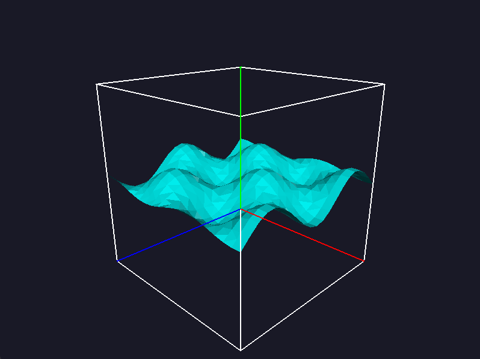
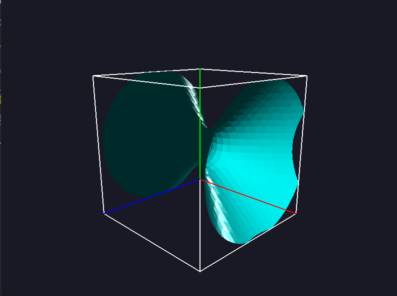

# Marching Cubes

A 3D isosurface visualizer built with OpenGL that uses the Marching Cubes algorithm to generate and render triangle meshes from volumetric scalar fields. Supports interactive camera controls, Phong-shaded lighting, and exports the resulting mesh to a `.ply` file for further use.

## Preview

  
  

## Features

- Implements the Marching Cubes algorithm for isosurface extraction
- Supports two scalar fields selectable via command-line
- Calculates normals for realistic Phong lighting
- Custom shaders and OpenGL pipeline with VAOs and interleaved VBOs
- Bounding box and coordinate axes for spatial reference
- Mesh export to PLY format
- Interactive camera: orbit with mouse, zoom with arrow keys

## Environment Setup

Follow these steps to configure your environment on Windows using MSYS2:

1. [**Install MSYS2**](https://www.msys2.org/) and install it in `C:\msys64`

2. **Open the MSYS2 MINGW64 terminal**, then run:
   ```bash
   pacman -Syu
   ```
   _(The terminal will close after updating. Reopen the MINGW64 terminal to continue.)_

3. **Install required packages**:
   ```bash
   pacman -S mingw-w64-x86_64-toolchain \
               mingw-w64-x86_64-freeglut \
               mingw-w64-x86_64-glew \
               mingw-w64-x86_64-glfw \
               mingw-w64-x86_64-glm
   ```

4. **Update your PATH**  
   Add the following to your user environment variables:
   ```
   C:\msys64\mingw64\bin
   ```

## Build and Run

1. Open `marchingCubes.cpp` in [Visual Studio Code](https://code.visualstudio.com/)
2. From the top menu, go to: `Terminal` → `Run Build Task`
3. Run the executable with:
   ```bash
   ./marchingCubes.exe <number>
   ```
   - Use `1` for surface 1 or `2` for surface 2  
   - If no argument is passed, surface 1 is used by default
